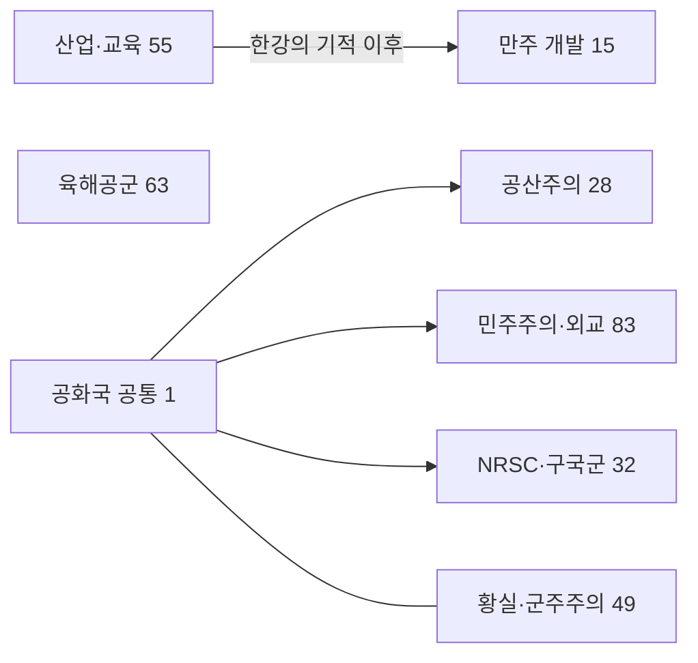

# 한국 중점 배치 좌표 명세 — 현재 460개와 이전 기준선 이력

## 2026-09-23 남은 82개 적용 — 현재 460개

**현재 H1 오른쪽 배치:** 사용자 요청에 따라 네 중점을 오른쪽 상단 공간으로 옮기고 `환국 지방실사`를 `계연수 축출`과 같은 기본 y=5에 맞췄다. 시작 (211,5) → (210,6)/(212,6) → (211,7)이며 기존 기준·자식 상대좌표를 유지한다. 현재 소스의 보존 검사 10/0과 배타선 높이를 포함한 20상태 모델은 통과했다. 실제 SHOW/HIDE 화면은 컴퓨터 제어 연결 장애로 미검수이며 로드 검증 상태는 [오른쪽 배치 기록](incidents/2026-09-23-hwan-focus-right.md)을 따른다. 이전 (185,10)의 초기 SHOW·왕정 완료 HIDE 관측은 [직전 배치 기록](incidents/2026-09-23-hwan-focus-layout.md)의 소스에만 적용하며 이번 위치의 증거로 재사용하지 않는다.

입헌군주·전제군주·환제국 각 14개, 만주 20개, 공통 산업·군사 20개를 **21개 짧은 정책 묶음**으로 추가했다. 기존 378개 중점 블록·좌표·상대 기준·7개 직접 offset·지속적 중점 패널·바로가기는 보존했다. 새 82개는 모두 기존 기준점의 상대 자손이며, 현재 절대 기준은 **7개**, 상대 배치는 **453개**다. 전체 기본 범위는 **x0~212/y0~24**다. 잔여 확장 당시 x0~211에서 이번 H1 오른쪽 배치로 오른쪽 끝만 1칸 늘었다. 각 노선의 전체 14~20개를 하나의 열에 직렬 연결하지 않았다.

현재 소스 SHA-256은 `1cedaf78903db31d15e3837e20069b71bca8fc674212b1d033f0d721b2b6735c`이며, [현재 460개 좌표 JSON](data/HOK_KOREAN_SECOND_WAVE_COORDINATES.json)의 노드·조건부 상태를 기준으로 삼는다. 직전 H1 수정 `dd2334a0…85613b4`, 잔여 확장 통합 `905a3868…1ccf852`, 이전 378개 `4cb9406b…fa8856`의 검증은 각 소스의 이력으로 보존한다. 현재 소스의 재실행 결과로 옮기지 않았다.

아래 좌표는 **조건부 이동 전 기본 절대좌표**다. `→ A / B →`는 두 중간 중점을 모두 마쳐야 합류하는 AND 구조이고, 말단이 없는 `→ A / B`는 서로 배타적이지 않은 두 독립 선택지다. 3개 직렬 묶음은 해당 분야 안의 짧은 행정 절차이며 다른 묶음의 끝에 이어 붙이지 않았다.

| 묶음 | 실제 진입·배치 부모 | 기본 절대좌표 순서 | 별도 완료 조건 |
|---|---|---|---|
| C1 책임내각 4 | 유교 민주주의 | (204,10) → (203,11)/(205,11) → (204,12) | 기존 입헌 정부 조건 |
| C2 사법 행정 4 | 공화주의자들과의 화해 | (210,8) → (209,9)/(211,9) → (210,10) | 사법부의 독립 보장 |
| C3 민생·후원 3 | 공화주의자들과의 화해 | (206,8) → (205,9)/(207,9) | 현대의 세종대왕 |
| C4 동맹 연락 3 | 연합국 합동군사훈련 | (202,14) → (201,15)/(203,15) | 기존 세력·입헌 정부 조건 |
| A1 비변사 문서 4 | 우리황실사랑회 | (206,1) → (205,2)/(207,2) → (206,3) | 비변사 부활 |
| A2 구휼 행정 3 | 우리황실사랑회 | (190,1) → (190,2) → (190,3) | 성리학 질서 재건 |
| A3 군제 전문화 4 | 우리황실사랑회 | (198,1) → (197,2)/(199,2) → (198,3) | 군제개혁 |
| A4 관료 전문화 3 | 우리황실사랑회 | (194,1) → (194,2) → (194,3) | 비변사 부활 |
| H1 지방 물자 4 | 왕의 귀환 | (211,5) → (210,6)/(212,6) → (211,7) | 환제국의 부활 |
| H2 연락망 4 | 우리황실사랑회 | (180,1) → (179,2)/(181,2) → (180,3) | 환제국의 부활 |
| H3 전후 재건 3 | 환 세계 질서 | (176,15) → (176,16) → (176,17) | 형성·평시·실제 운영 영토 조건 |
| H4 복원·훈련 3 | 환 세계 질서 | (180,15) → (180,16) → (180,17) | 형성·평시·실제 운영 영토 조건 |
| M1 지방 서비스 5 | 만주 계획 | (30,15) → (29,16)/(31,16) → (30,17) → (30,18) | 해당 지역 운영 조건 |
| M2 정착·조정 5 | 다문화 수용 | (17,16) → (16,17)/(18,17) → (17,18) → (17,19) | 기존 다민족 노선 보존 |
| M3 원료·회수 5 | 만주 지하자원 개발 | (24,20) → (23,21)/(25,21) → (24,22) → (24,23) | 극동의 병기창 완료 유지 |
| M4 도시 정착 5 | 국내성 신도시 건설 | (29,19) → (28,20)/(30,20) → (29,21) → (29,22) | 해당 지역 운영 조건 |
| G1 수출 실무 5 | 원화 평가 절하 | (32,1) → (31,3)/(33,3) → (32,4) → (32,5) | 경공업 수출 지원 |
| G2 자원 회수 5 | 운산 금광 | (0,6) → (0,7)/(2,7) → (1,8) → (1,9) | 함경 지하자원 개발 완료 유지 |
| G3 기동부대 4 | 기동 보병 | (34,5) → (33,6)/(35,6) → (34,7) | 기존 군사 진입 조건 |
| G4 수상함 훈련 3 | 대양함대 건설 | (48,4) → (47,6)/(49,6) | 기존 해군 진입 조건 |
| G5 악천후 비행 3 | 공군사관학교 투자 | (68,7) → (67,8)/(69,8) | 기존 공군 진입 조건 |

부모의 이름은 기존 한국어 표시명을 따르며, 정확한 ID와 상대 x/y는 JSON을 따른다. 모듈 진입 중점은 위의 기존 부모를 `relative_position_id`로 삼고, 후속은 선언이 앞선 모듈 진입 중점을 위치 기준으로 삼는다. 상대좌표는 `표의 기본 절대좌표 − 기준점의 기본 절대좌표`로 계산했다. 진행 선행조건과 위치 기준을 혼동하지 않는다.

일부 신규 묶음은 상단의 실제 진입점에서 선을 뻗고 기존의 세부 정책 완료를 `available`에 남겼다. 예를 들어 C2는 공화주의자들과의 화해에서 분기하지만 사법부의 독립 보장 이후에만 시작하며, A1은 황실 진입에서 분기하되 비변사 부활 이후에만 시작한다. 화면상 선만 보고 후속 정책을 조기에 시작할 수 있는 구조가 아니다. G1의 2행 및 G4의 5행은 고정 산업·군사 중점의 아이콘·이름판과 선을 통과시키지 않기 위해 비웠다.

M3는 원료·재활용 정책에 앞서 기존 35일 **만주 지하자원 개발**을 요구하고, G2는 복수 광산의 원료 분류·회수를 위해 기존 35일 **운산 금광**과 기존 함경 자원 개발을 함께 요구한다. 이는 새 정책의 자원 조사·개발 기반을 명시한 신규 진입 설계다. 기존 중점의 선행이나 보상은 바꾸지 않았다. 나머지 상단 진입 변경은 당초 세부 정책 완료 조건을 보존한다.

정치 이동은 정부의 현재 이념이 아니라 기존 왕정 기준점의 완료·표시 규칙을 따른다. **C/A/H 42개는 왕정 HIDE에서 −101x를 한 번 상속한다.** 입헌군주 정부가 민주주의여도 민주 공화국의 −35x를 적용하지 않으며, 환제국 역시 정부 이념에 따라 다른 기준점을 고르지 않는다. 왕정 구역의 HIDE x 범위는 잔여 확장 당시 x75~110에서 이번 H1 이동 후 **x75~111**이다. H1은 (110,5) → (109,6)/(111,6) → (110,7)로 계산된다. M/G 40개는 산업·군사·만주 구역에 고정되고 정치 offset이 없다. 신규 하위 왕정 가지를 감추는 별도 `allow_branch`는 만들지 않았으므로 왕정 선택 뒤 시작 불가능한 다른 왕정 정책이 표시될 수 있다.

H1 수정 전 `905a3868…1ccf852`의 **정적 좌표 검사 335 PASS / 0 FAIL**로 378개 원문 블록·좌표 보존, 82개 ID·선행·상대좌표·선언 순서, 7개 기준점·offset, 범위와 지역화 연결을 확인했다. 당시 SHOW/HIDE **20개 상태**의 아이콘/이름판·세 직교 선행선·가로 공선 모델과 8px 여유에서는 접촉 후보가 없었지만 **상호배타 연결선은 검사에 누락되어 있었다.** 따라서 옛 H1의 화면 안전성을 입증하지 못했다. 기존 실제 DDS와 100×88 새 DDS를 반영하고 동적 아이콘 다섯 개는 대체 크기를 쓴 모델 한계도 유지한다. 후속 수정은 이름판 높이의 배타선 영역을 포함해 옛 실패를 재현하고 새 H1의 20상태 접촉 0건을 별도로 확인했다.

H1 수정 전 460개 소스의 HIDE 1600×900·GUI 1.0에서는 C1~C4 전체, A1/A3 일부 및 A2/A4 상단, H2/H3/H4 전체, M1~M4와 G3 전체의 아이콘·이름판·연결을 관측했고 해당 영역의 새 겹침은 없었다. G1 전체 연결도 확인했으나 시작 아이콘은 상단 경계에 걸려 있었다. 당시 H1·G2/G4/G5 전체, SHOW·정치 선택 전부터 완료 후까지의 이동, 숨은 기준점과 전체 패널은 미검수였다. `normal-01`은 합성 왕정 분기 완료 HIDE의 일부 영역, 마지막 영토 검사들은 정치 미선택 초기 HIDE이므로 정상 정치 경로를 거친 압축 전환의 증거로 쓰지 않는다. 직전 H1 (185,10)의 추가 관측과 현재 오른쪽 배치의 미검수 상태는 위 두 배치 기록에서 구분한다.

기존 만주 바로가기를 누르면 구 만주 시작 중점의 제목이 하단 경계에 일부 걸리며 추가 스크롤로 새 M1~M4 전체에 접근할 수 있었다. 바로가기·패널 설정은 변경하지 않았다. 실제 진행으로는 C1 첫 중점 35일 완료와 M1 사업 UI 최초/재착수·90일 만료/대기·통제 상실 취소 등을 관측했으며 전체 트리의 정상 진행·저장 호환성까지 검증된 것은 아니다. 세부 실행 범위와 실패 이력은 [잔여 확장 기록](incidents/2026-09-23-korean-remaining-followup.md)을 따른다.

## 이전 378개·366개 적용 이력

> 2026-09-23 최신 적용: 파시즘 F4 점령행정·F5 삼군 조정·F6 재건예산 12개를 추가하여 현재 **378개**다. 기존 366개와 정치 offset은 보존하며 절대 기준 7개·상대 배치 371개, 전체 기본 범위 x0~204/y0~24를 유지한다. [후속 명세](HOK_KOREAN_FASCIST_FOLLOWUP_SPEC.md)와 [2차 계획](HOK_KOREAN_SECOND_WAVE_PLAN.md)의 최신 현황을 따른다. 아래 366개 단계와 그 이전 실행 결과는 해당 소스의 이력이며 신규 12개의 검증 결과가 아니다.

> 2026-09-22 병렬화: 공산 경제정책 뒤의 후속 내정·기술행정을 두 가지로 나눴다. Y1/Y3는 x73/x77, P1/P3는 x96/x100의 y14~18 안에 배치하며 선행조건 2개와 공유 결정 범주 표시 조건을 함께 조정했다. 보상·기간·상호배타는 보존했다. [현재 병렬 배치 기록](incidents/2026-09-22-korean-communist-parallel.md)을 따르며 아래 326개 이력과 구분한다.

> 2026-09-22 후속 적용: 현재 총366개(기존326+공산 경제정책10+후속 내정9+기술보급·계획행정9+파시즘 군수계약4+참모업무4+병역·필수인력4). 현재 구성·좌표·검증 상태는 [2차 확장 기록](HOK_KOREAN_SECOND_WAVE_PLAN.md)과 [F3 병역·필수인력 명세](HOK_KOREAN_FASCIST_MOBILIZATION_SPEC.md)를 따른다. 아래326개 좌표·화면 관측은 이전 기준선 이력이며 후속 추가분의 게임 검증 결과가 아니다.

> 파시즘 F2는 선군주의(`KOR_prussia_in_the_far_east`) `(169,5)` 기준 `(3,1)`의 참모보직 정비 `(172,6)`와 그 기준 `(-1,1)/(1,1)/(0,2)`의 후속 3개로 구성한다. 현재 전체 좌표는 [366개 JSON](data/HOK_KOREAN_SECOND_WAVE_COORDINATES.json), F2 선행·보상·검증 상태는 [F2 명세](HOK_KOREAN_FASCIST_STAFF_SPEC.md)를 따른다. [F3 명세](HOK_KOREAN_FASCIST_MOBILIZATION_SPEC.md)의 최종 4개는 군내 극우인사 포섭 `(167,3)`을 기준으로 `(174,4)` → `(173,5)/(175,5)` → `(174,6)`의 3행 대칭 가지다. 이전 진입선과 F2 합류선의 실제 공선을 해소하기 위해 새 F3만 옮겼으며 아래 역사적 326개 좌표표는 새로 생성하지 않는다.

작성일: 2026-09-21

> 2026-09-22 정치 선택 후 압축과 F3 추가: 현재 366개·절대 기준 7개·상대 배치 359개, 기본 범위 x0~204·y0~24다. 직접 offset은 기존 공통 진입 3개·정치 기준 4개를 유지한다. HIDE에서 해당 분기 중점을 완료했을 때만 아래 조건부 이동을 적용하며, SHOW·선택 전·진행 중에는 기본 배치를 유지한다. 정치 압축의 정적 검사·새 게임 로드 기록은 F3 추가 전 362개 소스의 결과다. F3의 130 PASS / 0 FAIL과 초기 HIDE 관측은 이전 배치 소스의 결과다. 이후 확대 HIDE의 진입선 공선으로 새 F3 배치를 수정했고 2026-09-23 최종 소스의 추가 정적 검사 44건·보상 재검사 130건은 모두 통과했고 진단 없는 새 게임(53b0)의 신규 정규화 오류는 0건이다. 이전 ESC 중지 뒤 별도 새 게임으로 최종 상단 구역의 HIDE/SHOW와 병역행정 명부의 정상 35일 완료를 확인했다. 두 화면은 각각 정치 분기 완료 합성 상태이며 초기부터의 압축 전환을 검증하지 않았다. 아래 326개 표와 이동량 0 기록은 역사적 기준선이다.

### 당시 366개 조건부 이동 명세

| 완료 노선 / HIDE | 정치 기준 이동 (x,y) | 계산한 기준점 x | 정치 구역 계산 x 범위 | 공화국 진입 계산 x |
|---|---|---:|---|---|
| 공산 | (-5,0) | 79 | 68~95 | 79 |
| 민주 | (-35,0) | 92 | 73~123 | 92 |
| 파시 | (-84,0) | 83 | 74~91 | 83 |
| 비동맹·왕정 | (-101,0) | 85 | 75~103 | 숨김 |

기존 362개의 기본 좌표·상대 기준·자손 내부 간격과 정치 offset을 보존하고 F3 4개를 추가했다. 공통 산업·군사·만주는 이동하지 않는다. 현재 366개 소스 SHA-256은 `91520275c5ce45e670e921355603b860fec524372ce0ee58c622b4c6d049b61f`이며 [현재 좌표 JSON](data/HOK_KOREAN_SECOND_WAVE_COORDINATES.json)과 [F3 명세](HOK_KOREAN_FASCIST_MOBILIZATION_SPEC.md)를 함께 읽는다. F3의 군내 극우인사 포섭 기준 상대좌표는 `(7,1)`, 명부 기준 후속은 `(-1,1)`·`(1,1)`·`(0,2)`다. 파시 HIDE 모델 좌표는 `(90,4)`·`(89,5)`·`(91,5)`·`(90,6)`이고 파시 구역 범위는 x74~91이다. 새 자식에 offset을 중복하지 않았다. 정치 압축 당시 362개 소스 검증은 [정치 압축 구현 기록](incidents/2026-09-22-korean-political-compaction.md)의 범위다. 이전 F3 소스 `6a5d06…f17a5d`의 정적 50·보상 130 PASS / 0 FAIL과 1600×900·GUI 1의 초기 HIDE 아이콘 관측을 최종 배치의 통과로 가져오지 않는다. 확대된 분기 완료 HIDE에서 이전 F3 진입선이 F2 합류선과 겹쳐 새 4개의 진입점과 좌표를 바꿨으며, 을해군란 완료 조건·보상·140일은 유지한다. 실제 이미지 크기의 무여백 SHOW/HIDE 사각형·선 접촉·공선 모델에는 후보가 없었다. 8px 여유 모델에는 을해군란 인근 후보 1개가 남으며 실제 화면의 선 분리와 클릭 영역을 증명하지 않는다. 2026-09-23 최종 추가 정적 44건·보상 재검사 130건이 통과했고 진단 없는 새 게임(53b0)의 신규 정규화 오류는 0건이다. 2026-09-23 별도의 정치 분기 완료 합성 새 게임에서 최종 F3 상단 구역의 HIDE와 SHOW를 각각 관측했다. 네 중점과 부모·을해군란·인접 F2의 선·아이콘·명판이 분리되어 있었고 SHOW의 인접 왕정 구역도 가리지 않았다. 이는 선택 전부터 완료 후까지의 압축 전환 검사가 아니다. 병역행정 명부 한 개의 UI 시작·35일 진행·완료 및 두 자식의 시작 가능 상태를 확인했다. 나머지 3개 정상 진행·최종 AND 차단·전체 140일·장기 AI는 미검증이다. 실제 화면과 좌표 모델의 근거는 [별도 구현 기록](incidents/2026-09-22-korean-fascist-mobilization.md)을 따른다.

### 아래 표의 역사적 범위

한국 중점 326개(기존 266개와 앞선 확장 60개)를 보존하면서 넓어진 배치를 압축했다. **당시 326개 범위는 x0~194, y0~24였으며 HIDE 초기 상태에서 전체 분야 화면 검수를 마쳤다.** 기간·효과·선행 AND/OR·상호배타·표시 조건·AI는 변경하지 않았다.

이번 비교의 기준선은 첫 재배치의 AA58 소스다. **기존 기본 절대**는 AA58의 넓은 배치, **새 기본 절대**는 현재 압축 배치다. 최초 좌표와 첫 재배치 관측은 [첫 재배치 이력](incidents/2026-09-21-korean-focus-layout.md)에 남기며 현재 검증 결과로 재사용하지 않는다.

관련 문서: [현재 배치 계획](HOK_KOREAN_FOCUS_LAYOUT_PLAN.md), [현재 압축 작업 기록](incidents/2026-09-21-korean-focus-compact.md), [326개 연결·좌표 JSON](data/HOK_KOREAN_FOCUS_LAYOUT_COORDINATES.json), [실제 소스](../common/national_focus/korea.txt).

## 2026-09-21 기준선 적용과 정적 확인

| 항목 | AA58 기준선 | 압축 적용 |
| --- | --- | --- |
| 중점 / 고유 ID | 326 / 326 | 326 / 326 |
| 기본 x 범위 | 0~636 | 0~194 |
| 기본 y 범위 | 0~42 | 0~24 |
| 절대 기준점 / 상대 배치 | 7 / 319 | 7 / 319 |
| 직접 offset 블록 | 4 | 4 |
| 직접 offset 이동량 | -8, -8, -25, -39 | 모두 (0, 0) |
| 지속적 중점 패널 | (200, 3400) | (200, 1700) |

가로 범위는 약 69.5%, 세로 범위는 약 42.9% 줄었다. 직접 offset 4개의 조건문은 보존하고 이동량만 0으로 바꾸어, HIDE 선택 후 표시되는 분야가 인접 분야 쪽으로 밀리지 않도록 했다. 기존 가지 숨김 조건은 그대로다.

AA58과 당시 326개 압축 소스의 focus 블록을 대조하여 좌표·상대 기준·offset 이동량과 주석을 제외한 토큰이 동일함을 확인했다. 통합 제안의 정적 중점 상자·연결선 기둥 모델은 간섭 후보를 보고하지 않았다. **실제 화면도 HIDE 초기 상태에서 전체 분야를 확인했으며, 관측 범위에서 이름판·아이콘 겹침과 관계없는 선의 중점 가림은 0건이었다.** 이 결과를 이념 전환 후 모든 표시 상태에 대한 검증으로 확대하지 않는다.

## 좌표를 읽는 방법

x/y는 중점 격자 단위이며 화면 픽셀이 아니다. 상대 중점의 기본 절대좌표는 `relative_position_id`의 위치에 상대 x/y를 더해 계산한다. `prerequisite`는 해금·연결 관계, `relative_position_id`는 위치 기준이다.

상대 ID가 “—”이면 절대 기준점이다. 나머지 행의 소스 x/y는 “상대 x/y”다. 이 역사적 326개 기준선에서는 직접 offset이 모두 0이므로 조건부 이동량도 0이며, HIDE의 표시 여부와 구분한다. “확장”은 이번 작업 전에 존재하던 60개를 뜻한다.

## 분야 관계와 범위

도식은 분야 관계만 나타낸다. 실제 축척·화면 위치나 모든 선행·상호배타 연결을 재현하지 않는다.

공화국 공통과 황실 사이 선은 상호배타 관계다.

| 분야 | 수량 | AA58 기본 x/y 범위 | 압축 기본 x/y 범위 |
| --- | ---: | --- | --- |
| 산업·교육 | 55 | x0~60, y0~22 | x0~30, y0~11 |
| 육해공군 | 63 | x70~156, y0~20 | x34~73, y0~10 |
| 만주 개발 | 15 | x32~64, y28~40 | x20~34, y14~19 |
| 공화국 공통 | 1 | x302~302, y0~0 | x117~117, y0~0 |
| 공산주의 | 28 | x184~232, y3~36 | x78~94, y2~14 |
| 민주주의·외교 | 83 | x246~396, y3~42 | x98~148, y2~24 |
| 국가재건최고회의·구국군 | 32 | x430~460, y3~39 | x152~162, y2~14 |
| 황실·군주주의 | 49 | x510~636, y0~42 | x166~194, y0~14 |

### 절대 기준점 7개

| 이름 | ID | 압축 기본 절대 | offset 담당 |
| --- | --- | --- | --- |
| 원화 평가 절하 | `KOR_devalue_the_won` | (15, 0) | 없음 |
| 재무장 시작 | `KOR_begin_rearmament` | (54, 0) | 없음 |
| 공화국의 미래 | `KOR_future_of_the_republic` | (117, 0) | 공화국 직접 (0, 0) |
| 프롤레타리아 독재여 영원하라! | `KOR_long_live_the_dictatorship_of_the_proletariat` | (84, 2) | 없음 |
| 전진하는 민주주의! | `KOR_democracy_advance_forward` | (117, 2) | 민주 직접 (0, 0) |
| 국가재건최고회의에 힘을! | `KOR_empowering_the_nrsc` | (157, 2) | NRSC 직접 (0, 0) |
| 우리황실사랑회 | `KOR_urihwangsilsaranghoe` | (176, 0) | 황실 직접 (0, 0) |

### 역사적 326개 기준선의 조건부 offset 4개

| 담당 ID | AA58 이동량 | 압축 이동량 | 보존한 조건 |
| --- | --- | --- | --- |
| `KOR_future_of_the_republic` | (-8, 0) | (0, 0) | HIDE + 공산·민주·NRSC 진입 중 하나 완료 |
| `KOR_democracy_advance_forward` | (-8, 0) | (0, 0) | HIDE + 민주 진입 완료 |
| `KOR_empowering_the_nrsc` | (-25, 0) | (0, 0) | HIDE + NRSC 진입 완료 |
| `KOR_urihwangsilsaranghoe` | (-39, 0) | (0, 0) | HIDE + 황실 진입 완료 |

공화국 공통과 민주 루트의 서로 다른 조건문을 합치지 않았다. 319개 상대 배치의 필요한 상대 x/y를 다시 계산했다. 공산 루트는 독립 절대 기준이며 직접 offset이 없다. 산업·군사·만주에는 직접 offset을 추가하지 않았다.

첫 재배치의 직접 offset 150→4개 정리, 기존 자식 146개의 상대 기준 상속, 새 민주 15개의 -8 정렬은 이전 이력이다. 이번 압축에서는 네 루트의 이동량을 0으로 바꾸었다.

## 분야별 전체 전후 좌표

8개 표는 중복 없이 전체 326개를 포함한다.

### 산업·교육 — 55개

| 이름 | ID | 분야 | 기존 기본 절대 (AA58) | 새 기본 절대 | 상대 ID | 상대 x/y | offset 담당 |
| --- | --- | --- | --- | --- | --- | --- | --- |
| 원화 평가 절하 | `KOR_devalue_the_won` | 경제 진입 | (30, 0) | (15, 0) | — | — | 없음 |
| 경공업 수출 지원 | `KOR_support_light_industry_export` | 경제 진입 | (30, 2) | (15, 1) | `KOR_devalue_the_won` | (0, 1) | 없음 |
| IFC에게 투자 요청 | `KOR_ask_the_ifc_to_invest` | 경제 진입 | (58, 2) | (30, 1) | `KOR_devalue_the_won` | (15, 1) | 없음 |
| 팔도 개발 위원회 | `KOR_eight_province_development_committee` | 지역 개발·전력 | (8, 4) | (5, 2) | `KOR_support_light_industry_export` | (-10, 1) | 없음 |
| 북부지방 개발 | `KOR_northern_development` | 지역 개발·전력 | (2, 6) | (1, 3) | `KOR_eight_province_development_committee` | (-4, 1) | 없음 |
| 남부지방 개발 | `KOR_southern_development` | 지역 개발·전력 | (8, 6) | (5, 3) | `KOR_eight_province_development_committee` | (0, 1) | 없음 |
| 중부지방 개발 | `KOR_central_region_development` | 지역 개발·전력 | (14, 6) | (9, 3) | `KOR_eight_province_development_committee` | (4, 1) | 없음 |
| 운산 금광 | `KOR_develop_unsan_gold_mine` | 지역 개발·전력 | (0, 8) | (0, 4) | `KOR_northern_development` | (-1, 1) | 없음 |
| 개마고원 목축업 지원 | `KOR_support_gaema_plateau` | 지역 개발·전력 | (4, 10) | (2, 5) | `KOR_hamgyeong_underground_resources` | (0, 1) | 없음 |
| 호남평야 가공식품 공장 | `KOR_honam_plain_food_factory` | 지역 개발·전력 | (6, 8) | (4, 4) | `KOR_southern_development` | (-1, 1) | 없음 |
| 대덕 산업단지 확장 | `KOR_saemangeum_reclamation` | 지역 개발·전력 | (10, 8) | (6, 4) | `KOR_southern_development` | (1, 1) | 없음 |
| 부산 자유무역지대 | `KOR_busan_free_trade_zone` | 지역 개발·전력 | (8, 10) | (5, 5) | `KOR_honam_plain_food_factory` | (1, 1) | 없음 |
| 재령평야 농업 지원 | `KOR_agricultural_support_in_jaeryeong_plain` | 지역 개발·전력 | (16, 8) | (10, 4) | `KOR_central_region_development` | (1, 1) | 없음 |
| 소양강댐 건설 재개 | `KOR_build_soyanggang_dam` | 지역 개발·전력 | (12, 10) | (8, 5) | `KOR_gangwon_underground_resources` | (0, 1) | 없음 |
| 서울대학교 확장 | `KOR_seoul_national_university_expansion` | 교육·연구 | (24, 4) | (14, 2) | `KOR_support_light_industry_export` | (-1, 1) | 없음 |
| 세계수준 석학 유치 | `KOR_attract_worldclass_scholars` | 교육·연구 | (28, 6) | (16, 3) | `KOR_seoul_national_university_expansion` | (2, 1) | 없음 |
| 함경도 지하자원 개발 | `KOR_hamgyeong_underground_resources` | 지역 개발·전력 | (4, 8) | (2, 4) | `KOR_northern_development` | (1, 1) | 없음 |
| 강원도 지하자원 개발 | `KOR_gangwon_underground_resources` | 지역 개발·전력 | (12, 8) | (8, 4) | `KOR_central_region_development` | (-1, 1) | 없음 |
| 국토개발종합계획 | `KOR_comprehensive_national_development_plan` | 지역 개발·전력 | (8, 12) | (5, 6) | `KOR_busan_free_trade_zone` | (0, 1) | 없음 |
| 경부고속도로 | `KOR_gyeongbu_expressway` | 기반시설·개발 사업 | (56, 4) | (28, 2) | `KOR_support_light_industry_export` | (13, 1) | 없음 |
| 경의고속도로 | `KOR_gyeongui_expressway` | 기반시설·개발 사업 | (56, 6) | (28, 3) | `KOR_gyeongbu_expressway` | (0, 1) | 없음 |
| 1기 신도시 계획 | `KOR_first_new_city_plan` | 기반시설·개발 사업 | (56, 8) | (28, 4) | `KOR_gyeongui_expressway` | (0, 1) | 없음 |
| 건설 붐 | `KOR_construction_boom` | 기반시설·개발 사업 | (52, 10) | (26, 5) | `KOR_first_new_city_plan` | (-2, 1) | 없음 |
| 중공업 개발 | `KOR_development_of_heavy_industry` | 중공업·생산 | (40, 4) | (22, 2) | `KOR_support_light_industry_export` | (7, 1) | 없음 |
| 구로공단 | `KOR_guro_industrial_complex` | 중공업·생산 | (36, 6) | (20, 3) | `KOR_development_of_heavy_industry` | (-2, 1) | 없음 |
| 포항제철 | `KOR_pohang_iron__steel_company` | 중공업·생산 | (40, 6) | (22, 3) | `KOR_development_of_heavy_industry` | (0, 1) | 없음 |
| 남동-임해공업지대 | `KOR_namdong_imhae_industrial_complex` | 중공업·생산 | (44, 6) | (24, 3) | `KOR_development_of_heavy_industry` | (2, 1) | 없음 |
| [GetSaemaulUndongName] | `KOR_saemaeul_undong` | 중공업·생산 | (40, 8) | (22, 4) | `KOR_pohang_iron__steel_company` | (0, 1) | 없음 |
| 산업화 사회로 진입 | `KOR_industrialized_society` | 중공업·생산 | (40, 10) | (22, 5) | `KOR_saemaeul_undong` | (0, 1) | 없음 |
| 한강의 기적 | `KOR_miracle_on_the_han_river` | 중공업·생산 | (48, 12) | (24, 6) | `KOR_construction_boom` | (-2, 1) | 없음 |
| 국방과학연구소 설립 | `KOR_create_add` | 교육·연구 | (28, 16) | (16, 7) | `KOR_attract_worldclass_scholars` | (0, 4) | 없음 |
| 석탄 액화 | `KOR_oil_from_korean_coal` | 교육·연구 | (26, 18) | (15, 8) | `KOR_create_add` | (-1, 1) | 없음 |
| 합성 고무 | `KOR_synthetic_rubber` | 교육·연구 | (26, 20) | (15, 9) | `KOR_oil_from_korean_coal` | (0, 1) | 없음 |
| 현대의 신기전 | `KOR_korean_jet_engine` | 교육·연구 | (30, 18) | (17, 8) | `KOR_create_add` | (1, 1) | 없음 |
| 무궁화 꽃이 피었습니다 | `KOR_mugunghwa_kkochi_pieossseubnida` | 교육·연구 | (30, 20) | (17, 9) | `KOR_korean_jet_engine` | (0, 1) | 없음 |
| 전국 전력망 연계 | `HOK_KOR_link_power_grids` | 지역 개발·전력 · 확장 | (8, 14) | (5, 7) | `KOR_comprehensive_national_development_plan` | (0, 1) | 없음 |
| 산업용 전력 배분 | `HOK_KOR_industrial_power_allocation` | 지역 개발·전력 · 확장 | (8, 16) | (5, 8) | `HOK_KOR_link_power_grids` | (0, 1) | 없음 |
| 공업 계량규격 통일 | `HOK_KOR_industrial_measurement_standards` | 지역 개발·전력 · 확장 | (8, 18) | (5, 9) | `HOK_KOR_industrial_power_allocation` | (0, 1) | 없음 |
| 공장 안전검사제 | `HOK_KOR_factory_safety_inspections` | 지역 개발·전력 · 확장 | (8, 20) | (5, 10) | `HOK_KOR_industrial_measurement_standards` | (0, 1) | 없음 |
| 국가전력조정위원회 | `HOK_KOR_national_power_coordination` | 지역 개발·전력 · 확장 | (8, 22) | (5, 11) | `HOK_KOR_factory_safety_inspections` | (0, 1) | 없음 |
| 실업전문학교 확충 | `HOK_KOR_technical_colleges` | 교육·연구 · 확장 | (20, 6) | (12, 3) | `KOR_seoul_national_university_expansion` | (-2, 1) | 없음 |
| 공장 도제교육 | `HOK_KOR_workshop_apprenticeships` | 교육·연구 · 확장 | (20, 8) | (12, 4) | `HOK_KOR_technical_colleges` | (0, 1) | 없음 |
| 노동자 야간학교 | `HOK_KOR_workers_night_schools` | 교육·연구 · 확장 | (20, 10) | (12, 5) | `HOK_KOR_workshop_apprenticeships` | (0, 1) | 없음 |
| 산학 공동연구실 | `HOK_KOR_university_industry_labs` | 교육·연구 · 확장 | (20, 12) | (12, 6) | `HOK_KOR_workers_night_schools` | (0, 1) | 없음 |
| 숙련공 양성체계 | `HOK_KOR_skilled_workforce` | 교육·연구 · 확장 | (20, 14) | (12, 7) | `HOK_KOR_university_industry_labs` | (0, 1) | 없음 |
| 생산공정 실태조사 | `HOK_KOR_production_review` | 중공업·생산 · 확장 | (32, 6) | (18, 3) | `KOR_development_of_heavy_industry` | (-4, 1) | 없음 |
| 표준규격 대량생산 | `HOK_KOR_standardized_mass_production` | 중공업·생산 · 확장 | (30, 8) | (17, 4) | `HOK_KOR_production_review` | (-1, 1) | 없음 |
| 유연한 생산라인 | `HOK_KOR_flexible_production_lines` | 중공업·생산 · 확장 | (34, 8) | (19, 4) | `HOK_KOR_production_review` | (1, 1) | 없음 |
| 생산품 품질보증 | `HOK_KOR_production_quality_assurance` | 중공업·생산 · 확장 | (32, 10) | (18, 5) | `HOK_KOR_production_review` | (0, 2) | 없음 |
| 통합 생산계획 | `HOK_KOR_integrated_production_planning` | 중공업·생산 · 확장 | (32, 12) | (18, 6) | `HOK_KOR_production_quality_assurance` | (0, 1) | 없음 |
| 지역 공업 투자기금 | `HOK_KOR_regional_industry_fund` | 기반시설·개발 사업 · 확장 | (60, 10) | (30, 5) | `KOR_first_new_city_plan` | (2, 1) | 없음 |
| 평안 기계공업 육성 | `HOK_KOR_pyeongan_machine_workshops` | 기반시설·개발 사업 · 확장 | (60, 12) | (30, 6) | `HOK_KOR_regional_industry_fund` | (0, 1) | 없음 |
| 강원 전기기기 공업 | `HOK_KOR_gangwon_electrical_workshops` | 기반시설·개발 사업 · 확장 | (60, 14) | (30, 7) | `HOK_KOR_pyeongan_machine_workshops` | (0, 1) | 없음 |
| 충청 부품공급망 | `HOK_KOR_chungcheong_supplier_network` | 기반시설·개발 사업 · 확장 | (60, 16) | (30, 8) | `HOK_KOR_gangwon_electrical_workshops` | (0, 1) | 없음 |
| 경상 수출조선 지원 | `HOK_KOR_gyeongsang_export_workshops` | 기반시설·개발 사업 · 확장 | (60, 18) | (30, 9) | `HOK_KOR_chungcheong_supplier_network` | (0, 1) | 없음 |

### 육해공군 — 63개

| 이름 | ID | 분야 | 기존 기본 절대 (AA58) | 새 기본 절대 | 상대 ID | 상대 x/y | offset 담당 |
| --- | --- | --- | --- | --- | --- | --- | --- |
| 재무장 시작 | `KOR_begin_rearmament` | 군 재무장 | (112, 0) | (54, 0) | — | — | 없음 |
| 계룡대 건설 | `KOR_build_the_gyeryongdae` | 육군 | (70, 2) | (34, 1) | `KOR_begin_rearmament` | (-20, 1) | 없음 |
| 국방정신전력원 창설 | `KOR_establish_dasmfe` | 육군 | (70, 4) | (34, 2) | `KOR_build_the_gyeryongdae` | (0, 1) | 없음 |
| 대한민국 육군 | `KOR_daehanminguk_yuggun` | 육군 | (86, 2) | (42, 1) | `KOR_begin_rearmament` | (-12, 1) | 없음 |
| 육군 확장 | `KOR_army_augmentation` | 육군 | (82, 4) | (40, 2) | `KOR_daehanminguk_yuggun` | (-2, 1) | 없음 |
| 제1공수군단 창설 | `KOR_organization_rokasf` | 육군 | (90, 4) | (46, 2) | `KOR_daehanminguk_yuggun` | (4, 1) | 없음 |
| 기갑 중점 | `KOR_armored_focus` | 육군 | (74, 6) | (36, 3) | `KOR_army_augmentation` | (-4, 1) | 없음 |
| 기동 보병 | `KOR_mobile_infantry` | 육군 | (74, 8) | (36, 4) | `KOR_armored_focus` | (0, 1) | 없음 |
| 기갑 선봉대 | `KOR_armored_vanguard` | 육군 | (74, 10) | (36, 5) | `KOR_mobile_infantry` | (0, 1) | 없음 |
| 보병 중점 | `KOR_infantry_focus` | 육군 | (82, 6) | (40, 3) | `KOR_army_augmentation` | (0, 1) | 없음 |
| 신형 소총 개발 | `KOR_new_model_rifle` | 육군 | (80, 8) | (39, 4) | `KOR_infantry_focus` | (-1, 1) | 없음 |
| 개선된 화포 도입 | `KOR_improved_artillery` | 육군 | (84, 8) | (41, 4) | `KOR_infantry_focus` | (1, 1) | 없음 |
| 비전투병과 확대 | `KOR_expansion_of_non_combat_support_units` | 육군 | (82, 10) | (40, 5) | `KOR_infantry_focus` | (0, 2) | 없음 |
| 육군 교리 연구 | `KOR_research_army_doctrine` | 육군 | (78, 12) | (38, 6) | `KOR_army_augmentation` | (-2, 4) | 없음 |
| 대한민국 해군 | `KOR_daehanminguk_haegun` | 해군 | (116, 2) | (55, 1) | `KOR_begin_rearmament` | (1, 1) | 없음 |
| 독일 조선공 포섭 | `KOR_invitation_of_foreign_naval_designers` | 해군 | (114, 4) | (55, 2) | `KOR_daehanminguk_haegun` | (0, 1) | 없음 |
| 대한민국 해병대 창설 | `KOR_organization_rokmc` | 해군 | (96, 4) | (48, 2) | `KOR_begin_rearmament` | (-6, 2) | 없음 |
| 대양함대 건설 | `KOR_large_surface_fleet` | 해군 | (108, 6) | (52, 3) | `KOR_invitation_of_foreign_naval_designers` | (-3, 1) | 없음 |
| 세종대왕급 전함 | `KOR_battleship_focus` | 해군 | (102, 8) | (50, 4) | `KOR_large_surface_fleet` | (-2, 1) | 없음 |
| 백두산급 항공모함 | `KOR_carrier_focus` | 해군 | (106, 8) | (52, 4) | `KOR_large_surface_fleet` | (0, 1) | 없음 |
| 신조 대형함 건조 | `KOR_build_new_ship` | 해군 | (104, 10) | (51, 5) | `KOR_large_surface_fleet` | (-1, 2) | 없음 |
| 통상파괴 중점 | `KOR_commerce_raiding` | 해군 | (120, 6) | (58, 3) | `KOR_invitation_of_foreign_naval_designers` | (3, 1) | 없음 |
| 신형 잠수함 도입 | `KOR_new_submarine` | 해군 | (120, 8) | (58, 4) | `KOR_commerce_raiding` | (0, 1) | 없음 |
| 잠수함대 | `KOR_submarine_Squadron` | 해군 | (120, 10) | (58, 5) | `KOR_new_submarine` | (0, 1) | 없음 |
| 비전 1950 | `KOR_vision_1950` | 해군 | (116, 18) | (51, 6) | `KOR_invitation_of_foreign_naval_designers` | (-4, 4) | 없음 |
| 제주 해군기지 건설 | `KOR_jeju_naval_base` | 해군 | (118, 20) | (52, 7) | `KOR_vision_1950` | (1, 1) | 없음 |
| 반도 조선시설 확장 | `KOR_peninsula_dockyard` | 해군 | (114, 20) | (50, 7) | `KOR_vision_1950` | (-1, 1) | 없음 |
| 대한민국 공군 | `KOR_daehanminguk_gonggun` | 공군 | (146, 2) | (69, 1) | `KOR_begin_rearmament` | (15, 1) | 없음 |
| 신형 전투기 | `KOR_new_fighter` | 공군 | (146, 4) | (69, 2) | `KOR_daehanminguk_gonggun` | (0, 1) | 없음 |
| 공군기지 확대 | `KOR_expand_air_bases` | 공군 | (138, 4) | (65, 2) | `KOR_daehanminguk_gonggun` | (-4, 1) | 없음 |
| 제1방공포병여단 | `KOR_1st_air_defense_brigade` | 공군 | (154, 4) | (73, 2) | `KOR_daehanminguk_gonggun` | (4, 1) | 없음 |
| 한국항공우주산업 | `KOR_korea_aerospace_industry` | 공군 | (146, 6) | (69, 3) | `KOR_new_fighter` | (0, 1) | 없음 |
| 전술 공군 | `KOR_tactical_air_force` | 공군 | (140, 8) | (65, 4) | `KOR_korea_aerospace_industry` | (-4, 1) | 없음 |
| 항공 포병대 | `KOR_air_artillery` | 공군 | (140, 10) | (65, 5) | `KOR_tactical_air_force` | (0, 1) | 없음 |
| 전략 공군 | `KOR_strategic_air_force` | 공군 | (144, 8) | (67, 4) | `KOR_korea_aerospace_industry` | (-2, 1) | 없음 |
| 적의 본토를 불태워라! | `KOR_burn_the_enemy_mainland` | 공군 | (144, 10) | (67, 5) | `KOR_strategic_air_force` | (0, 1) | 없음 |
| 공군사관학교 투자 | `KOR_establishment_of_the_afoc` | 공군 | (142, 12) | (66, 6) | `KOR_korea_aerospace_industry` | (-3, 3) | 없음 |
| 제트기의 시대로 | `KOR_age_of_jet` | 공군 | (142, 14) | (66, 7) | `KOR_establishment_of_the_afoc` | (0, 1) | 없음 |
| 국방조달계약 | `HOK_KOR_procurement_contracts` | 육군 · 확장 | (90, 6) | (45, 3) | `KOR_army_augmentation` | (5, 1) | 없음 |
| 탄약 규격 통일 | `HOK_KOR_ammunition_standards` | 육군 · 확장 | (90, 8) | (45, 4) | `HOK_KOR_procurement_contracts` | (0, 1) | 없음 |
| 병기 검사제도 | `HOK_KOR_ordnance_inspection` | 육군 · 확장 | (88, 10) | (44, 5) | `HOK_KOR_ammunition_standards` | (-1, 1) | 없음 |
| 야전 정비창 | `HOK_KOR_field_maintenance` | 육군 · 확장 | (92, 10) | (46, 5) | `HOK_KOR_ammunition_standards` | (1, 1) | 없음 |
| 분산 군수창 체계 | `HOK_KOR_distributed_ordnance_depots` | 육군 · 확장 | (90, 12) | (45, 6) | `HOK_KOR_ordnance_inspection` | (1, 1) | 없음 |
| 참모부 도상훈련 | `HOK_KOR_staff_exercises` | 육군 · 확장 | (78, 14) | (38, 7) | `KOR_research_army_doctrine` | (0, 1) | 없음 |
| 개마고원 동계훈련 | `HOK_KOR_winter_training` | 육군 · 확장 | (76, 16) | (37, 8) | `HOK_KOR_staff_exercises` | (-1, 1) | 없음 |
| 산악 정찰학교 | `HOK_KOR_mountain_reconnaissance` | 육군 · 확장 | (80, 16) | (39, 8) | `HOK_KOR_staff_exercises` | (1, 1) | 없음 |
| 무선 지휘망 표준화 | `HOK_KOR_radio_coordination` | 육군 · 확장 | (78, 18) | (38, 9) | `HOK_KOR_staff_exercises` | (0, 2) | 없음 |
| 제병협동 연습 | `HOK_KOR_joint_arms_exercises` | 육군 · 확장 | (78, 20) | (38, 10) | `HOK_KOR_radio_coordination` | (0, 1) | 없음 |
| 진해 수리창 정비 | `HOK_KOR_rapid_repairs` | 해군 · 확장 | (128, 4) | (61, 2) | `KOR_daehanminguk_haegun` | (6, 1) | 없음 |
| 다도해 기동훈련 | `HOK_KOR_archipelago_training` | 해군 · 확장 | (126, 6) | (60, 3) | `HOK_KOR_rapid_repairs` | (-1, 1) | 없음 |
| 호위전대 학교 | `HOK_KOR_escort_school` | 해군 · 확장 | (130, 6) | (62, 3) | `HOK_KOR_rapid_repairs` | (1, 1) | 없음 |
| 대잠전 학교 | `HOK_KOR_anti_submarine_school` | 해군 · 확장 | (128, 8) | (61, 4) | `HOK_KOR_rapid_repairs` | (0, 2) | 없음 |
| 함포지원 연락체계 | `HOK_KOR_coastal_fire_control` | 해군 · 확장 | (128, 10) | (61, 5) | `HOK_KOR_anti_submarine_school` | (0, 1) | 없음 |
| 함대 참모학교 | `HOK_KOR_fleet_staff_college` | 해군 · 확장 | (112, 8) | (55, 4) | `KOR_invitation_of_foreign_naval_designers` | (0, 2) | 없음 |
| 해상 보급절차 | `HOK_KOR_underway_replenishment` | 해군 · 확장 | (110, 10) | (54, 5) | `HOK_KOR_fleet_staff_college` | (-1, 1) | 없음 |
| 갑판 운용학교 | `HOK_KOR_deck_training` | 해군 · 확장 | (114, 10) | (56, 5) | `HOK_KOR_fleet_staff_college` | (1, 1) | 없음 |
| 해공 합동연락망 | `HOK_KOR_naval_air_coordination` | 해군 · 확장 | (112, 12) | (55, 6) | `HOK_KOR_fleet_staff_college` | (0, 2) | 없음 |
| 상륙지원 합동연습 | `HOK_KOR_amphibious_rehearsals` | 해군 · 확장 | (112, 14) | (55, 7) | `HOK_KOR_naval_air_coordination` | (0, 1) | 없음 |
| 국산 설계 역량 집중 | `HOK_KOR_domestic_aircraft_designs` | 공군 · 확장 | (152, 8) | (71, 4) | `KOR_korea_aerospace_industry` | (2, 1) | 없음 |
| 우방 항공기술 도입 | `HOK_KOR_foreign_aircraft_designs` | 공군 · 확장 | (156, 8) | (73, 4) | `KOR_korea_aerospace_industry` | (4, 1) | 없음 |
| 편대전술 표준화 | `HOK_KOR_formation_flying` | 공군 · 확장 | (154, 10) | (72, 5) | `KOR_korea_aerospace_industry` | (3, 2) | 없음 |
| 항공정비학교 | `HOK_KOR_air_maintenance_school` | 공군 · 확장 | (154, 12) | (72, 6) | `HOK_KOR_formation_flying` | (0, 1) | 없음 |
| 항공전훈 연구반 | `HOK_KOR_combat_lessons_center` | 공군 · 확장 | (154, 14) | (72, 7) | `HOK_KOR_air_maintenance_school` | (0, 1) | 없음 |

### 만주 개발 — 15개

| 이름 | ID | 분야 | 기존 기본 절대 (AA58) | 새 기본 절대 | 상대 ID | 상대 x/y | offset 담당 |
| --- | --- | --- | --- | --- | --- | --- | --- |
| 만주 계획 | `KOR_the_manchurian_project` | 만주 개발 | (48, 28) | (24, 14) | `KOR_miracle_on_the_han_river` | (0, 8) | 없음 |
| 만주 유전지대 개발 | `KOR_manchurian_oil` | 만주 개발 | (52, 32) | (34, 15) | `KOR_the_manchurian_project` | (10, 1) | 없음 |
| 다문화 수용 | `KOR_multiethnic_embrace` | 만주 개발 | (36, 31) | (21, 15) | `KOR_the_manchurian_project` | (-3, 1) | 없음 |
| 유대인 정착 허가 | `KOR_invitation_jewish` | 만주 개발 | (40, 34) | (22, 17) | `KOR_multiethnic_embrace` | (1, 2) | 없음 |
| 반공 러시아인 정착 허가 | `KOR_invitation_white_russian` | 만주 개발 | (32, 34) | (20, 17) | `KOR_multiethnic_embrace` | (-1, 2) | 없음 |
| 코리안 드림 | `KOR_korean_dream` | 만주 개발 | (36, 37) | (21, 18) | `KOR_multiethnic_embrace` | (0, 3) | 없음 |
| 발해 연방 | `KOR_proclaim_federation_of_balhae` | 만주 개발 | (36, 40) | (21, 19) | `KOR_korean_dream` | (0, 1) | 없음 |
| 문화 동화정책 | `KOR_deportation_of_chinese_from_manchuria` | 만주 개발 | (60, 31) | (27, 15) | `KOR_the_manchurian_project` | (3, 1) | 없음 |
| 한국인 거주지 건설 | `KOR_korean_settlement` | 만주 개발 | (56, 34) | (26, 17) | `KOR_deportation_of_chinese_from_manchuria` | (-1, 2) | 없음 |
| 한국어 교육 의무화 | `KOR_teaching_korean_to_manchurians` | 만주 개발 | (64, 34) | (28, 17) | `KOR_deportation_of_chinese_from_manchuria` | (1, 2) | 없음 |
| 국내성 신도시 건설 | `KOR_rebuild_guknaeseong_as_new_city` | 만주 개발 | (60, 37) | (27, 18) | `KOR_deportation_of_chinese_from_manchuria` | (0, 3) | 없음 |
| 고구려의 부활 | `KOR_revive_of_goguryo` | 만주 개발 | (60, 40) | (27, 19) | `KOR_rebuild_guknaeseong_as_new_city` | (0, 1) | 없음 |
| 만주 중공업 시설 재건 | `KOR_rebuild_manchurian_heavy_industry_facility` | 만주 개발 | (48, 34) | (24, 17) | `KOR_the_manchurian_project` | (0, 3) | 없음 |
| 극동의 무기고 | `KOR_arsenal_of_far_east` | 만주 개발 | (48, 37) | (24, 18) | `KOR_rebuild_manchurian_heavy_industry_facility` | (0, 1) | 없음 |
| 만주 지하자원 개발 | `KOR_resource_exploration_in_manchuria` | 만주 개발 | (48, 40) | (24, 19) | `KOR_arsenal_of_far_east` | (0, 1) | 없음 |

### 공화국 공통 — 1개

| 이름 | ID | 분야 | 기존 기본 절대 (AA58) | 새 기본 절대 | 상대 ID | 상대 x/y | offset 담당 |
| --- | --- | --- | --- | --- | --- | --- | --- |
| 공화국의 미래 | `KOR_future_of_the_republic` | 공화국 공통 | (302, 0) | (117, 0) | — | — | 공화국 직접 (0, 0) |

### 공산주의 — 28개

| 이름 | ID | 분야 | 기존 기본 절대 (AA58) | 새 기본 절대 | 상대 ID | 상대 x/y | offset 담당 |
| --- | --- | --- | --- | --- | --- | --- | --- |
| 프롤레타리아 독재여 영원하라! | `KOR_long_live_the_dictatorship_of_the_proletariat` | 공산 진입 | (202, 3) | (84, 2) | — | — | 없음 |
| 노동조합 포섭 | `KOR_agitate_the_union` | 공산 진입 | (202, 6) | (84, 3) | `KOR_long_live_the_dictatorship_of_the_proletariat` | (0, 1) | 없음 |
| 임시인민위원회 조직 | `KOR_formation_of_the_provisional_peoples_committee` | 공산 진입 | (202, 9) | (84, 4) | `KOR_agitate_the_union` | (0, 1) | 없음 |
| 조선인민공화국 선포 | `KOR_proclaim_peoples_republic_of_korea` | 공산 진입 | (202, 12) | (84, 5) | `KOR_formation_of_the_provisional_peoples_committee` | (0, 1) | 없음 |
| 여운형 주석 | `KOR_yeo_woon_hyung_as_the_leader` | 공산 지도부·내정 | (190, 15) | (80, 6) | `KOR_proclaim_peoples_republic_of_korea` | (-4, 1) | 없음 |
| 박헌영 주석 | `KOR_park_heon_young_as_the_leader` | 공산 지도부·내정 | (214, 15) | (88, 6) | `KOR_proclaim_peoples_republic_of_korea` | (4, 1) | 없음 |
| 재벌 자산 국유화 | `KOR_confiscation_of_chaebol_assets` | 공산 지도부·내정 | (202, 18) | (84, 7) | `KOR_proclaim_peoples_republic_of_korea` | (0, 2) | 없음 |
| 내전의 교훈 | `KOR_lessons_form_the_civil_war` | 공산 지도부·내정 | (202, 21) | (84, 8) | `KOR_confiscation_of_chaebol_assets` | (0, 1) | 없음 |
| 남만주 포격도발 | `KOR_korea_manchuria_border_dispute` | 공산 지도부·내정 | (202, 24) | (84, 9) | `KOR_lessons_form_the_civil_war` | (0, 1) | 없음 |
| 민주공산주의 | `KOR_democratic_communism` | 공산 지도부·내정 | (190, 18) | (80, 7) | `KOR_yeo_woon_hyung_as_the_leader` | (0, 1) | 없음 |
| 고통 분담 | `KOR_pain_sharing` | 공산 지도부·내정 | (190, 21) | (80, 8) | `KOR_democratic_communism` | (0, 1) | 없음 |
| 농촌 진흥계획 | `KOR_rural_support_plan` | 공산 지도부·내정 | (190, 24) | (80, 9) | `KOR_pain_sharing` | (0, 1) | 없음 |
| 세계 혁명의 길 | `KOR_road_to_world_revolution` | 공산 지도부·내정 | (214, 18) | (88, 7) | `KOR_park_heon_young_as_the_leader` | (0, 1) | 없음 |
| 반동분자 숙청 | `KOR_purge_reactionarist` | 공산 지도부·내정 | (214, 21) | (88, 8) | `KOR_road_to_world_revolution` | (0, 1) | 없음 |
| 스탈린식 중공업 | `KOR_heavy_industry_concentration` | 공산 지도부·내정 | (214, 24) | (88, 9) | `KOR_purge_reactionarist` | (0, 1) | 없음 |
| 반 파시스트 동맹 | `KOR_anti_fascist_coalition` | 공산 대외전략 | (190, 27) | (80, 11) | `KOR_proclaim_peoples_republic_of_korea` | (-4, 6) | 없음 |
| 서구 자본가와 협상 | `KOR_collaborating_with_western_capitalists` | 공산 대외전략 | (184, 30) | (78, 12) | `KOR_anti_fascist_coalition` | (-2, 1) | 없음 |
| 국공합작 가담 | `KOR_join_the_chinese_united_front` | 공산 대외전략 | (196, 30) | (82, 12) | `KOR_anti_fascist_coalition` | (2, 1) | 없음 |
| 일본을 공격한다 | `KOR_ilboneul_gonggyeoghanda` | 공산 대외전략 | (196, 36) | (82, 14) | `KOR_rural_support_plan` | (2, 5) | 없음 |
| 코민테른과 함께 | `KOR_join_the_comintern` | 공산 대외전략 | (208, 27) | (86, 11) | `KOR_proclaim_peoples_republic_of_korea` | (2, 6) | 없음 |
| 소련의 경제원조 | `KOR_soviet_economic_aid` | 공산 대외전략 | (208, 30) | (86, 12) | `KOR_join_the_comintern` | (0, 1) | 없음 |
| 동시베리아 양도요청 | `KOR_request_for_Siberia` | 공산 대외전략 | (208, 33) | (86, 13) | `KOR_soviet_economic_aid` | (0, 1) | 없음 |
| 아시아 해방 준비 | `KOR_preparing_for_asian_liberation` | 공산 대외전략 | (226, 27) | (92, 11) | `KOR_proclaim_peoples_republic_of_korea` | (8, 6) | 없음 |
| 일본공산당 지원 | `KOR_support_the_japanese_communist_party` | 공산 대외전략 | (220, 30) | (90, 12) | `KOR_preparing_for_asian_liberation` | (-2, 1) | 없음 |
| 중국공산당 지원 | `KOR_support_the_chinese_communist_party` | 공산 대외전략 | (232, 30) | (94, 12) | `KOR_preparing_for_asian_liberation` | (2, 1) | 없음 |
| 일본 봉건주의자 공격 | `KOR_overthrow_of_japanese_feudalist` | 공산 대외전략 | (220, 33) | (90, 13) | `KOR_support_the_japanese_communist_party` | (0, 1) | 없음 |
| 공산당 없인 신중국도 없다 | `KOR_no_cpc_no_new_china` | 공산 대외전략 | (232, 33) | (94, 13) | `KOR_support_the_chinese_communist_party` | (0, 1) | 없음 |
| 서구 자본가 공격 | `KOR_attack_the_western_imperialists` | 공산 대외전략 | (220, 36) | (90, 14) | `KOR_rural_support_plan` | (10, 5) | 없음 |

### 민주주의·외교 — 83개

| 이름 | ID | 분야 | 기존 기본 절대 (AA58) | 새 기본 절대 | 상대 ID | 상대 x/y | offset 담당 |
| --- | --- | --- | --- | --- | --- | --- | --- |
| 전진하는 민주주의! | `KOR_democracy_advance_forward` | 민주 진입 | (302, 3) | (117, 2) | — | — | 민주 직접 (0, 0) |
| 김구 대통령 | `KOR_president_kim_gu` | 민주 진입 | (276, 6) | (108, 3) | `KOR_democracy_advance_forward` | (-9, 1) | 민주 상대 기준 (0, 0) |
| 이승만 재선 | `KOR_syngman_rhee_reelected` | 민주 진입 | (330, 6) | (126, 3) | `KOR_democracy_advance_forward` | (9, 1) | 민주 상대 기준 (0, 0) |
| 독립당 단독집권 | `KOR_independent_party_in_power` | 민주 진입 | (276, 9) | (108, 4) | `KOR_president_kim_gu` | (0, 1) | 민주 상대 기준 (0, 0) |
| 재벌과의 협력 | `KOR_cooperation_with_the_jaebeol` | 민주 내정·국방 | (320, 12) | (123, 6) | `KOR_democracy_advance_forward` | (6, 4) | 민주 상대 기준 (0, 0) |
| 자유당 단독집권 | `KOR_liberal_party_sole_power` | 민주 진입 | (330, 9) | (126, 4) | `KOR_syngman_rhee_reelected` | (0, 1) | 민주 상대 기준 (0, 0) |
| 민주주의는 우리의 힘 | `KOR_democracy_is_our_strength` | 민주 내정·국방 | (286, 12) | (111, 6) | `KOR_democracy_advance_forward` | (-6, 4) | 민주 상대 기준 (0, 0) |
| 극단주의 금지 | `KOR_ban_extremism` | 민주 내정·국방 | (298, 12) | (115, 6) | `KOR_democracy_advance_forward` | (-2, 4) | 민주 상대 기준 (0, 0) |
| 정부 지원 강화 | `KOR_strengthen_government_support` | 민주 내정·국방 | (292, 15) | (113, 7) | `KOR_liberal_party_sole_power` | (-13, 3) | 민주 상대 기준 (0, 0) |
| 조국 단결 | `KOR_national_unity` | 민주 내정·국방 | (288, 18) | (112, 9) | `KOR_strengthen_government_support` | (-1, 2) | 민주 상대 기준 (0, 0) |
| 군 예산안 증액 | `KOR_expend_military_budget` | 민주 내정·국방 | (306, 18) | (118, 9) | `KOR_liberal_party_sole_power` | (-8, 5) | 민주 상대 기준 (0, 0) |
| 향토방위특별법 제정 | `KOR_homeland_defence_special_act` | 민주 내정·국방 | (288, 21) | (112, 11) | `KOR_strengthen_government_support` | (-1, 4) | 민주 상대 기준 (0, 0) |
| 국민방위군 소집 | `KOR_call_up_the_rokrf` | 민주 내정·국방 | (300, 21) | (116, 11) | `KOR_strengthen_government_support` | (3, 4) | 민주 상대 기준 (0, 0) |
| 아시아 민주주의의 선봉 | `KOR_the_vanguard_of_asian_democracy` | 아시아 민주주의·연합 | (252, 12) | (100, 6) | `KOR_independent_party_in_power` | (-8, 2) | 민주 상대 기준 (0, 0) |
| 온건외교 중단 | `KOR_stop_moderate_diplomacy` | 아시아 민주주의·연합 | (252, 15) | (100, 7) | `KOR_the_vanguard_of_asian_democracy` | (0, 1) | 민주 상대 기준 (0, 0) |
| 평화주의와의 전쟁 | `KOR_war_on_pacifism` | 아시아 민주주의·연합 | (252, 18) | (100, 9) | `KOR_stop_moderate_diplomacy` | (0, 2) | 민주 상대 기준 (0, 0) |
| 북벌론 | `KOR_claiming_northern_conquest` | 아시아 민주주의·연합 | (252, 21) | (100, 11) | `KOR_war_on_pacifism` | (0, 2) | 민주 상대 기준 (0, 0) |
| 만주 선제타격 | `KOR_preemptive_strike_on_manchuria` | 아시아 민주주의·연합 | (258, 24) | (102, 13) | `KOR_claiming_northern_conquest` | (2, 2) | 민주 상대 기준 (0, 0) |
| 한중동맹 | `KOR_rok_roc_alliance` | 아시아 민주주의·연합 | (246, 24) | (98, 13) | `KOR_claiming_northern_conquest` | (-2, 2) | 민주 상대 기준 (0, 0) |
| 다음 전쟁의 준비 | `KOR_prepare_for_the_next_war` | 민주 내정·국방 | (308, 12) | (119, 6) | `KOR_democracy_advance_forward` | (2, 4) | 민주 상대 기준 (0, 0) |
| 홍범도선 건설 | `KOR_construction_syngman_rhee_line` | 민주 내정·국방 | (316, 15) | (121, 7) | `KOR_prepare_for_the_next_war` | (2, 1) | 민주 상대 기준 (0, 0) |
| 홍범도선 최종 요새화 | `KOR_syngman_rhee_line_final_fortifications` | 민주 내정·국방 | (316, 18) | (121, 9) | `KOR_construction_syngman_rhee_line` | (0, 2) | 민주 상대 기준 (0, 0) |
| 항구 요새화 | `KOR_port_fortification` | 민주 내정·국방 | (316, 21) | (121, 11) | `KOR_syngman_rhee_line_final_fortifications` | (0, 2) | 민주 상대 기준 (0, 0) |
| 세계 속의 대한민국 | `KOR_korea_in_the_world` | 서방·미국 외교 | (366, 12) | (138, 6) | `KOR_liberal_party_sole_power` | (12, 2) | 민주 상대 기준 (0, 0) |
| 서쪽을 믿자 | `KOR_trust_in_the_west` | 서방·미국 외교 | (342, 15) | (130, 7) | `KOR_korea_in_the_world` | (-8, 1) | 민주 상대 기준 (0, 0) |
| 연합국 가입 | `KOR_join_the_allie` | 서방·미국 외교 | (342, 18) | (130, 9) | `KOR_trust_in_the_west` | (0, 2) | 민주 상대 기준 (0, 0) |
| 상선 추가 징발 | `KOR_expand_merchant_marine` | 서방·미국 외교 | (336, 21) | (128, 11) | `KOR_join_the_allie` | (-2, 2) | 민주 상대 기준 (0, 0) |
| 영국 구축함 구매 | `KOR_british_naval_ship` | 서방·미국 외교 | (336, 24) | (128, 13) | `KOR_expand_merchant_marine` | (0, 2) | 민주 상대 기준 (0, 0) |
| 샤쇠르-알팡 교관초빙 | `KOR_learn_from_french_army` | 서방·미국 외교 | (348, 21) | (132, 11) | `KOR_join_the_allie` | (2, 2) | 민주 상대 기준 (0, 0) |
| 연합국 군사원조 | `KOR_allies_military_aid` | 서방·미국 외교 | (348, 24) | (132, 13) | `KOR_learn_from_french_army` | (0, 2) | 민주 상대 기준 (0, 0) |
| 유럽원정군사령부 창설 | `KOR_eef_command` | 서방·미국 외교 | (342, 30) | (130, 17) | `KOR_join_the_allie` | (0, 8) | 민주 상대 기준 (0, 0) |
| 미국과의 접촉 | `KOR_contect_with_america` | 서방·미국 외교 | (390, 15) | (146, 7) | `KOR_korea_in_the_world` | (8, 1) | 민주 상대 기준 (0, 0) |
| 한미상호방위조약 | `KOR_rok_us_mutual_defense_treaty` | 서방·미국 외교 | (390, 18) | (146, 9) | `KOR_contect_with_america` | (0, 2) | 민주 상대 기준 (0, 0) |
| 주한미군 배치 | `KOR_usfk` | 서방·미국 외교 | (384, 21) | (144, 11) | `KOR_rok_us_mutual_defense_treaty` | (-2, 2) | 민주 상대 기준 (0, 0) |
| KATUSA | `KOR_katusa` | 서방·미국 외교 | (384, 24) | (144, 13) | `KOR_usfk` | (0, 2) | 민주 상대 기준 (0, 0) |
| 미국의 경제원조 | `KOR_lend_lease_from_usa` | 서방·미국 외교 | (396, 21) | (148, 11) | `KOR_rok_us_mutual_defense_treaty` | (2, 2) | 민주 상대 기준 (0, 0) |
| 맥아더 초청 | `KOR_invite_macarthur` | 서방·미국 외교 | (396, 24) | (148, 13) | `KOR_lend_lease_from_usa` | (0, 2) | 민주 상대 기준 (0, 0) |
| 자유국가기구 창설 | `KOR_establish_ofn` | 서방·미국 외교 | (390, 30) | (146, 17) | `KOR_rok_us_mutual_defense_treaty` | (0, 8) | 민주 상대 기준 (0, 0) |
| 연합국 흡수 | `KOR_absorb_the_allies` | 서방·미국 외교 | (384, 33) | (144, 19) | `KOR_establish_ofn` | (-2, 2) | 민주 상대 기준 (0, 0) |
| 구 영연방 확보 | `KOR_securing_the_former_commonwealth` | 서방·미국 외교 | (396, 33) | (148, 19) | `KOR_establish_ofn` | (2, 2) | 민주 상대 기준 (0, 0) |
| 멸공의 횃불 | `KOR_torch_of_the_freedom` | 서방·미국 외교 | (390, 36) | (146, 21) | `KOR_establish_ofn` | (0, 4) | 민주 상대 기준 (0, 0) |
| 베네룩스 보호 | `KOR_protect_benelux` | 서방·미국 외교 | (384, 39) | (144, 23) | `KOR_torch_of_the_freedom` | (-2, 2) | 민주 상대 기준 (0, 0) |
| 국가사회주의 척결 | `KOR_crash_the_nazis` | 서방·미국 외교 | (384, 42) | (144, 24) | `KOR_protect_benelux` | (0, 1) | 민주 상대 기준 (0, 0) |
| 핀란드 보호 | `KOR_protect_finland` | 서방·미국 외교 | (396, 39) | (148, 23) | `KOR_torch_of_the_freedom` | (2, 2) | 민주 상대 기준 (0, 0) |
| 곰 사냥 | `KOR_hunt_the_bear` | 서방·미국 외교 | (396, 42) | (148, 24) | `KOR_protect_finland` | (0, 1) | 민주 상대 기준 (0, 0) |
| 대한의용군단 | `KOR_korean_volunteer_corps` | 서방·미국 외교 | (366, 18) | (138, 9) | `KOR_korea_in_the_world` | (0, 3) | 민주 상대 기준 (0, 0) |
| 탈식민의 물결 | `KOR_forced_decolonization` | 서방·미국 외교 | (338, 33) | (129, 19) | `KOR_korea_in_the_world` | (-9, 13) | 민주 상대 기준 (0, 0) |
| 인도차이나에 자유를 | `KOR_freedom_to_indochina` | 서방·미국 외교 | (338, 36) | (129, 21) | `KOR_forced_decolonization` | (0, 2) | 민주 상대 기준 (0, 0) |
| 말레이시아에 자유를 | `KOR_freedom_to_malaysia` | 서방·미국 외교 | (332, 36) | (127, 21) | `KOR_forced_decolonization` | (-2, 2) | 민주 상대 기준 (0, 0) |
| 필리핀에 자유를 | `KOR_freedom_to_philippines` | 서방·미국 외교 | (344, 36) | (131, 21) | `KOR_forced_decolonization` | (2, 2) | 민주 상대 기준 (0, 0) |
| 인도네시아에 자유를 | `KOR_freedom_to_indonesia` | 서방·미국 외교 | (338, 39) | (129, 23) | `KOR_forced_decolonization` | (0, 4) | 민주 상대 기준 (0, 0) |
| ABCDFK 포위망 | `KOR_abcdfk_blocade` | 서방·미국 외교 | (356, 33) | (135, 19) | `KOR_korea_in_the_world` | (-3, 13) | 민주 상대 기준 (0, 0) |
| 시암에 압력 행사 | `KOR_pressure_on_thailand` | 서방·미국 외교 | (350, 36) | (133, 21) | `KOR_abcdfk_blocade` | (-2, 2) | 민주 상대 기준 (0, 0) |
| 류큐와 아이누의 해방 보장 | `KOR_freedom_to_ryukyu_and_ainu` | 서방·미국 외교 | (362, 36) | (137, 21) | `KOR_abcdfk_blocade` | (2, 2) | 민주 상대 기준 (0, 0) |
| 위협의 끝 | `KOR_end_the_threat` | 서방·미국 외교 | (356, 39) | (135, 23) | `KOR_abcdfk_blocade` | (0, 4) | 민주 상대 기준 (0, 0) |
| 유럽의 해방 | `KOR_liberation_of_the_europe` | 아시아 민주주의·연합 | (246, 27) | (100, 15) | `KOR_preemptive_strike_on_manchuria` | (-2, 2) | 민주 상대 기준 (0, 0) |
| 아시아 연합 창설 | `KOR_founding_of_the_asian_union` | 아시아 민주주의·연합 | (266, 27) | (105, 15) | `KOR_preemptive_strike_on_manchuria` | (3, 2) | 민주 상대 기준 (0, 0) |
| 아시아 독립국가 초대 | `KOR_invitation_to_independent_asian_countries` | 아시아 민주주의·연합 | (266, 30) | (105, 17) | `KOR_founding_of_the_asian_union` | (0, 2) | 민주 상대 기준 (0, 0) |
| 중국 초대 | `KOR_invite_china` | 아시아 민주주의·연합 | (254, 30) | (101, 17) | `KOR_founding_of_the_asian_union` | (-4, 2) | 민주 상대 기준 (0, 0) |
| 중국 민주인사 지원 | `KOR_support_for_democracy_in_china` | 아시아 민주주의·연합 | (246, 30) | (98, 17) | `KOR_founding_of_the_asian_union` | (-7, 2) | 민주 상대 기준 (0, 0) |
| 중국 독재자 축출 | `KOR_overthrow_the_chinese_dictators` | 아시아 민주주의·연합 | (246, 33) | (98, 19) | `KOR_support_for_democracy_in_china` | (0, 2) | 민주 상대 기준 (0, 0) |
| 일본 초대 | `KOR_invite_japan` | 아시아 민주주의·연합 | (278, 30) | (109, 17) | `KOR_founding_of_the_asian_union` | (4, 2) | 민주 상대 기준 (0, 0) |
| 일본 민주인사 지원 | `KOR_support_for_democracy_in_japan` | 아시아 민주주의·연합 | (286, 30) | (111, 17) | `KOR_founding_of_the_asian_union` | (6, 2) | 민주 상대 기준 (0, 0) |
| 민슈 잇키 | `KOR_minshu_ikki` | 아시아 민주주의·연합 | (286, 33) | (111, 19) | `KOR_support_for_democracy_in_japan` | (0, 2) | 민주 상대 기준 (0, 0) |
| 아시아 독립 지원 | `KOR_asian_independence_support` | 아시아 민주주의·연합 | (266, 33) | (105, 19) | `KOR_invitation_to_independent_asian_countries` | (0, 2) | 민주 상대 기준 (0, 0) |
| 유럽 제국주의자 축출 | `KOR_expelling_european_imperialists` | 아시아 민주주의·연합 | (266, 36) | (105, 21) | `KOR_asian_independence_support` | (0, 2) | 민주 상대 기준 (0, 0) |
| 파시스트들에게 죽음을 | `KOR_death_to_the_fascists` | 아시아 민주주의·연합 | (258, 36) | (102, 21) | `KOR_asian_independence_support` | (-3, 2) | 민주 상대 기준 (0, 0) |
| 붉은 역병의 종말 | `KOR_end_of_the_red_plague` | 아시아 민주주의·연합 | (274, 36) | (107, 21) | `KOR_asian_independence_support` | (2, 2) | 민주 상대 기준 (0, 0) |
| 국정 협의위원회 | `HOK_KOR_parliamentary_committee` | 민주 행정·교육 · 확장 | (274, 18) | (107, 9) | `KOR_strengthen_government_support` | (-6, 2) | 민주 상대 기준 (0, 0) |
| 공직 감찰 정비 | `HOK_KOR_civil_service_audit` | 민주 행정·교육 · 확장 | (270, 21) | (106, 11) | `HOK_KOR_parliamentary_committee` | (-1, 2) | 민주 상대 기준 (0, 0) |
| 실업·시민교육 확대 | `HOK_KOR_technical_civic_schools` | 민주 행정·교육 · 확장 | (278, 21) | (109, 11) | `HOK_KOR_parliamentary_committee` | (2, 2) | 민주 상대 기준 (0, 0) |
| 농촌 순회교육 | `HOK_KOR_rural_education_missions` | 민주 행정·교육 · 확장 | (278, 24) | (109, 13) | `HOK_KOR_technical_civic_schools` | (0, 2) | 민주 상대 기준 (0, 0) |
| 국회 결산위원회 | `HOK_KOR_public_accounts_committee` | 민주 행정·교육 · 확장 | (274, 27) | (107, 14) | `HOK_KOR_parliamentary_committee` | (0, 5) | 민주 상대 기준 (0, 0) |
| 의용군 연락본부 | `HOK_KOR_volunteer_liaison_bureau` | 의용군 후속 · 확장 | (366, 21) | (138, 11) | `KOR_korean_volunteer_corps` | (0, 2) | 민주 상대 기준 (0, 0) |
| 해외 의료지원반 | `HOK_KOR_overseas_medical_detachments` | 의용군 후속 · 확장 | (360, 24) | (136, 13) | `HOK_KOR_volunteer_liaison_bureau` | (-2, 2) | 민주 상대 기준 (0, 0) |
| 의용군 보급계획 | `HOK_KOR_volunteer_supply_depots` | 의용군 후속 · 확장 | (372, 24) | (140, 13) | `HOK_KOR_volunteer_liaison_bureau` | (2, 2) | 민주 상대 기준 (0, 0) |
| 전훈 교류 | `HOK_KOR_expeditionary_lessons` | 의용군 후속 · 확장 | (366, 27) | (138, 15) | `HOK_KOR_volunteer_liaison_bureau` | (0, 4) | 민주 상대 기준 (0, 0) |
| 해외 구호망 | `HOK_KOR_overseas_relief_network` | 의용군 후속 · 확장 | (366, 30) | (138, 16) | `HOK_KOR_expeditionary_lessons` | (0, 1) | 민주 상대 기준 (0, 0) |
| 아시아 공동통상사무국 | `HOK_KOR_asian_trade_secretariat` | 아시아 경제협력 · 확장 | (300, 30) | (116, 17) | `KOR_founding_of_the_asian_union` | (11, 2) | 민주 상대 기준 (0, 0) |
| 아시아 관세협약 | `HOK_KOR_asian_customs_convention` | 아시아 경제협력 · 확장 | (294, 33) | (114, 19) | `HOK_KOR_asian_trade_secretariat` | (-2, 2) | 민주 상대 기준 (0, 0) |
| 아시아 공동개발기금 | `HOK_KOR_asian_development_fund` | 아시아 경제협력 · 확장 | (294, 36) | (114, 21) | `HOK_KOR_asian_customs_convention` | (0, 2) | 민주 상대 기준 (0, 0) |
| 아시아 공동군수위원회 | `HOK_KOR_asian_armaments_commission` | 아시아 경제협력 · 확장 | (306, 33) | (118, 19) | `HOK_KOR_asian_trade_secretariat` | (2, 2) | 민주 상대 기준 (0, 0) |
| 아시아 면허생산협정 | `HOK_KOR_asian_license_agreement` | 아시아 경제협력 · 확장 | (306, 36) | (118, 21) | `HOK_KOR_asian_armaments_commission` | (0, 2) | 민주 상대 기준 (0, 0) |

### 국가재건최고회의·구국군 — 32개

| 이름 | ID | 분야 | 기존 기본 절대 (AA58) | 새 기본 절대 | 상대 ID | 상대 x/y | offset 담당 |
| --- | --- | --- | --- | --- | --- | --- | --- |
| 국가재건최고회의에 힘을! | `KOR_empowering_the_nrsc` | 구국군 진입·내정 | (445, 3) | (157, 2) | — | — | NRSC 직접 (0, 0) |
| 군내 극우인사 포섭 | `KOR_gathering_the_farright_in_the_military` | 구국군 진입·내정 | (445, 6) | (157, 3) | `KOR_empowering_the_nrsc` | (0, 1) | NRSC 상대 기준 (0, 0) |
| 을해군란 | `KOR_establishment_of_the_national_salvation_army` | 구국군 진입·내정 | (445, 9) | (157, 4) | `KOR_gathering_the_farright_in_the_military` | (0, 1) | NRSC 상대 기준 (0, 0) |
| 한국식 민주주의 | `KOR_stop_democracy` | 구국군 진입·내정 | (445, 12) | (157, 5) | `KOR_establishment_of_the_national_salvation_army` | (0, 1) | NRSC 상대 기준 (0, 0) |
| 삼청교육대 | `KOR_samcheong_re_education_camp` | 구국군 진입·내정 | (445, 15) | (157, 6) | `KOR_stop_democracy` | (0, 1) | NRSC 상대 기준 (0, 0) |
| 국군정보사령부 | `KOR_armed_forces_intelligence_command` | 구국군 진입·내정 | (439, 12) | (155, 5) | `KOR_establishment_of_the_national_salvation_army` | (-2, 1) | NRSC 상대 기준 (0, 0) |
| 선군주의 | `KOR_prussia_in_the_far_east` | 구국군 진입·내정 | (451, 12) | (159, 5) | `KOR_establishment_of_the_national_salvation_army` | (2, 1) | NRSC 상대 기준 (0, 0) |
| 재벌 길들이기 | `KOR_taming_the_jaebeol` | 구국군 진입·내정 | (439, 15) | (155, 6) | `KOR_armed_forces_intelligence_command` | (0, 1) | NRSC 상대 기준 (0, 0) |
| 세계위에 군림하는 대한 | `KOR_korea_reigns_above_the_world` | 구국군 진입·내정 | (445, 18) | (157, 7) | `KOR_establishment_of_the_national_salvation_army` | (0, 3) | NRSC 상대 기준 (0, 0) |
| 삼족오 소년단 | `KOR_threelegged_boys` | 구국군 진입·내정 | (451, 15) | (159, 6) | `KOR_prussia_in_the_far_east` | (0, 1) | NRSC 상대 기준 (0, 0) |
| 방공협정 서명 | `KOR_anticommunism_agreement_signed` | 구국군 진입·내정 | (445, 21) | (157, 8) | `KOR_korea_reigns_above_the_world` | (0, 1) | NRSC 상대 기준 (0, 0) |
| 고구려의 기억 | `KOR_memory_of_goguryeo` | 대륙 진출 | (436, 24) | (154, 9) | `KOR_anticommunism_agreement_signed` | (-3, 1) | NRSC 상대 기준 (0, 0) |
| 만슐루스 | `KOR_manchulus` | 대륙 진출 | (436, 27) | (154, 10) | `KOR_memory_of_goguryeo` | (0, 1) | NRSC 상대 기준 (0, 0) |
| 연해주 요구 | `KOR_demand_primorye` | 대륙 진출 | (430, 30) | (152, 11) | `KOR_manchulus` | (-2, 1) | NRSC 상대 기준 (0, 0) |
| 몽골에게 복종 요구 | `KOR_demands_submission_to_mongolia` | 대륙 진출 | (430, 33) | (152, 12) | `KOR_demand_primorye` | (0, 1) | NRSC 상대 기준 (0, 0) |
| 신류 상황 | `KOR_operation_hyojong` | 대륙 진출 | (430, 36) | (152, 13) | `KOR_demands_submission_to_mongolia` | (0, 1) | NRSC 상대 기준 (0, 0) |
| 산둥반도 요구 | `KOR_demand_shandong` | 대륙 진출 | (436, 30) | (154, 11) | `KOR_manchulus` | (0, 1) | NRSC 상대 기준 (0, 0) |
| 을지 상황 | `KOR_operation_eulji` | 대륙 진출 | (436, 33) | (154, 12) | `KOR_demand_shandong` | (0, 1) | NRSC 상대 기준 (0, 0) |
| 티베트의 운명 | `KOR_fate_of_tibet` | 대륙 진출 | (436, 36) | (154, 13) | `KOR_operation_eulji` | (0, 1) | NRSC 상대 기준 (0, 0) |
| 몽강 괴뢰화 | `KOR_puppet_mengjiang` | 대륙 진출 | (442, 30) | (156, 11) | `KOR_manchulus` | (2, 1) | NRSC 상대 기준 (0, 0) |
| 충무 상황 | `KOR_operation_chungmu` | 대륙 진출 | (442, 33) | (156, 12) | `KOR_puppet_mengjiang` | (0, 1) | NRSC 상대 기준 (0, 0) |
| 낙일 | `KOR_fall_of_the_sun` | 대륙 진출 | (442, 36) | (156, 13) | `KOR_operation_chungmu` | (0, 1) | NRSC 상대 기준 (0, 0) |
| 남방 공격 | `KOR_southern_attack` | 대륙 진출 | (439, 39) | (155, 14) | `KOR_fall_of_the_sun` | (-1, 1) | NRSC 상대 기준 (0, 0) |
| 충장 상황 | `KOR_horang_horang_horang` | 대륙 진출 | (445, 39) | (157, 14) | `KOR_fall_of_the_sun` | (1, 1) | NRSC 상대 기준 (0, 0) |
| 반공 우방과의 유대 | `KOR_ties_with_anti_communist_allies` | 반공 우방 | (454, 24) | (160, 9) | `KOR_anticommunism_agreement_signed` | (3, 1) | NRSC 상대 기준 (0, 0) |
| 독일과의 친선 | `KOR_friendship_with_germany` | 반공 우방 | (451, 27) | (159, 10) | `KOR_ties_with_anti_communist_allies` | (-1, 1) | NRSC 상대 기준 (0, 0) |
| 추축국 가입 | `KOR_join_the_axis` | 반공 우방 | (451, 30) | (159, 11) | `KOR_friendship_with_germany` | (0, 1) | NRSC 상대 기준 (0, 0) |
| 한국의 장군참모 | `KOR_korean_general_staff` | 반공 우방 | (448, 33) | (158, 12) | `KOR_join_the_axis` | (-1, 1) | NRSC 상대 기준 (0, 0) |
| 독일의 기술 | `KOR_german_technology` | 반공 우방 | (454, 33) | (160, 12) | `KOR_ties_with_anti_communist_allies` | (0, 3) | NRSC 상대 기준 (0, 0) |
| 일본과의 친선 | `KOR_friendship_with_japan` | 반공 우방 | (457, 27) | (161, 10) | `KOR_ties_with_anti_communist_allies` | (1, 1) | NRSC 상대 기준 (0, 0) |
| 공영권 가입 | `KOR_join_the_co_prosperity_sphere` | 반공 우방 | (457, 30) | (161, 11) | `KOR_friendship_with_japan` | (0, 1) | NRSC 상대 기준 (0, 0) |
| 일제 무기 구매 | `KOR_purchase_japanese_weapons` | 반공 우방 | (460, 33) | (162, 12) | `KOR_join_the_co_prosperity_sphere` | (1, 1) | NRSC 상대 기준 (0, 0) |

### 황실·군주주의 — 49개

| 이름 | ID | 분야 | 기존 기본 절대 (AA58) | 새 기본 절대 | 상대 ID | 상대 x/y | offset 담당 |
| --- | --- | --- | --- | --- | --- | --- | --- |
| 우리황실사랑회 | `KOR_urihwangsilsaranghoe` | 황실 복위 | (570, 0) | (176, 0) | — | — | 황실 직접 (0, 0) |
| 라디오 미디어 장악 | `KOR_take_control_the_radio_media` | 황실 복위 | (570, 3) | (176, 1) | `KOR_urihwangsilsaranghoe` | (0, 1) | 황실 상대 기준 (0, 0) |
| 덕수궁 평의회 | `KOR_deoksugung_pyeonguihoe` | 황실 복위 | (570, 6) | (176, 2) | `KOR_take_control_the_radio_media` | (0, 1) | 황실 상대 기준 (0, 0) |
| 헌법 개정 | `KOR_revise_the_constitution` | 황실 복위 | (570, 9) | (176, 3) | `KOR_deoksugung_pyeonguihoe` | (0, 1) | 황실 상대 기준 (0, 0) |
| 왕의 귀환 | `KOR_return_of_the_king` | 황실 복위 | (570, 12) | (176, 4) | `KOR_revise_the_constitution` | (0, 1) | 황실 상대 기준 (0, 0) |
| 제국섭정 계연수 | `KOR_imperial_regent_gyeyeonsu` | 계연수·환제국 | (516, 15) | (168, 5) | `KOR_return_of_the_king` | (-8, 1) | 황실 상대 기준 (0, 0) |
| 근황주의자 숙청 | `KOR_purge_the_imperialists` | 계연수·환제국 | (516, 18) | (168, 6) | `KOR_imperial_regent_gyeyeonsu` | (0, 1) | 황실 상대 기준 (0, 0) |
| 공교육에 환단고기 도입 | `KOR_educate_hwandangogi` | 계연수·환제국 | (510, 21) | (166, 7) | `KOR_purge_the_imperialists` | (-2, 1) | 황실 상대 기준 (0, 0) |
| 단군 우상화 | `KOR_idolization_dangun` | 계연수·환제국 | (522, 21) | (170, 7) | `KOR_purge_the_imperialists` | (2, 1) | 황실 상대 기준 (0, 0) |
| 환-신비주의 광신 | `KOR_ideological_fanaticism` | 계연수·환제국 | (516, 24) | (168, 8) | `KOR_purge_the_imperialists` | (0, 2) | 황실 상대 기준 (0, 0) |
| 대북방 평정 | `KOR_northern_restoration` | 계연수·환제국 | (516, 27) | (168, 9) | `KOR_ideological_fanaticism` | (0, 1) | 황실 상대 기준 (0, 0) |
| 환제국의 부활 | `KOR_empire_of_hwan` | 계연수·환제국 | (516, 30) | (168, 10) | `KOR_northern_restoration` | (0, 1) | 황실 상대 기준 (0, 0) |
| 황하문명 탈환 | `KOR_retake_yellow_river_civilization` | 계연수·환제국 | (510, 33) | (166, 11) | `KOR_empire_of_hwan` | (-2, 1) | 황실 상대 기준 (0, 0) |
| 인두국 정복 | `KOR_conquest_indu` | 계연수·환제국 | (510, 36) | (166, 12) | `KOR_retake_yellow_river_civilization` | (0, 1) | 황실 상대 기준 (0, 0) |
| 수밀이국 재건 | `KOR_sumilyee` | 계연수·환제국 | (510, 39) | (166, 13) | `KOR_conquest_indu` | (0, 1) | 황실 상대 기준 (0, 0) |
| 야뫼도 점령 | `KOR_occupat_yamoedo` | 계연수·환제국 | (522, 33) | (170, 11) | `KOR_empire_of_hwan` | (2, 1) | 황실 상대 기준 (0, 0) |
| 사납아와 통고사의 해방 | `KOR_liberation_of_sanaba_and_tonggosa` | 계연수·환제국 | (522, 36) | (170, 12) | `KOR_occupat_yamoedo` | (0, 1) | 황실 상대 기준 (0, 0) |
| 우리의 진정한 적 | `KOR_our_true_enemy` | 계연수·환제국 | (522, 39) | (170, 13) | `KOR_liberation_of_sanaba_and_tonggosa` | (0, 1) | 황실 상대 기준 (0, 0) |
| 환 세계 질서 | `KOR_hwan_world_order` | 계연수·환제국 | (516, 42) | (168, 14) | `KOR_empire_of_hwan` | (0, 4) | 황실 상대 기준 (0, 0) |
| 계연수 축출 | `KOR_oppose_gyeyeonsu` | 황실 진로 선택 | (604, 15) | (186, 5) | `KOR_return_of_the_king` | (10, 1) | 황실 상대 기준 (0, 0) |
| 성리학 질서 재건 | `KOR_reconstruction_confusian_order` | 성리학 군주정 | (580, 18) | (180, 6) | `KOR_oppose_gyeyeonsu` | (-6, 1) | 황실 상대 기준 (0, 0) |
| 비변사 부활 | `KOR_revive_bibyeonsa` | 성리학 군주정 | (580, 21) | (180, 7) | `KOR_reconstruction_confusian_order` | (0, 1) | 황실 상대 기준 (0, 0) |
| 카이저라이히와 함께 | `KOR_go_with_kaiserreich` | 성리학 군주정 | (562, 24) | (174, 8) | `KOR_revive_bibyeonsa` | (-6, 1) | 황실 상대 기준 (0, 0) |
| 민족주의자 선동 | `KOR_agitate_nationalist` | 성리학 군주정 | (574, 24) | (178, 8) | `KOR_revive_bibyeonsa` | (-2, 1) | 황실 상대 기준 (0, 0) |
| 군제개혁 | `KOR_reform_military` | 성리학 군주정 | (586, 24) | (182, 8) | `KOR_revive_bibyeonsa` | (2, 1) | 황실 상대 기준 (0, 0) |
| 사포대 재창설 | `KOR_reconstruction_sapodae` | 성리학 군주정 | (580, 27) | (180, 9) | `KOR_revive_bibyeonsa` | (0, 2) | 황실 상대 기준 (0, 0) |
| 간도 반란 | `KOR_gando_revellion` | 성리학 군주정 | (580, 30) | (180, 10) | `KOR_reconstruction_sapodae` | (0, 1) | 황실 상대 기준 (0, 0) |
| 삼전도의 복수 | `KOR_revenge_samjeondo` | 성리학 군주정 | (574, 33) | (178, 11) | `KOR_gando_revellion` | (-2, 1) | 황실 상대 기준 (0, 0) |
| 소중화 | `KOR_sojunghwa` | 성리학 군주정 | (586, 33) | (182, 11) | `KOR_gando_revellion` | (2, 1) | 황실 상대 기준 (0, 0) |
| 천명 주장 | `KOR_claim_the_mandate_of_heaven` | 성리학 군주정 | (580, 36) | (180, 12) | `KOR_gando_revellion` | (0, 2) | 황실 상대 기준 (0, 0) |
| 한명제국 | `KOR_korean_ming_empire` | 성리학 군주정 | (574, 39) | (178, 13) | `KOR_claim_the_mandate_of_heaven` | (-2, 1) | 황실 상대 기준 (0, 0) |
| 임진년의 복수 | `KOR_revenge_yimjin` | 성리학 군주정 | (586, 39) | (182, 13) | `KOR_claim_the_mandate_of_heaven` | (2, 1) | 황실 상대 기준 (0, 0) |
| 최후의 제국 | `KOR_the_last_empire` | 성리학 군주정 | (580, 42) | (180, 14) | `KOR_claim_the_mandate_of_heaven` | (0, 2) | 황실 상대 기준 (0, 0) |
| 황제의 명령 | `KOR_emperors_order` | 황제·공통 군사 | (604, 24) | (186, 8) | `KOR_oppose_gyeyeonsu` | (0, 3) | 황실 상대 기준 (0, 0) |
| 황실근위사단 창설 | `KOR_royal_guards_division` | 황제·공통 군사 | (598, 27) | (184, 9) | `KOR_emperors_order` | (-2, 1) | 황실 상대 기준 (0, 0) |
| 황제의 친정 | `KOR_march_of_the_king` | 황제·공통 군사 | (598, 30) | (184, 10) | `KOR_royal_guards_division` | (0, 1) | 황실 상대 기준 (0, 0) |
| 현대의 세종대왕 | `KOR_modern_sejong_the_great` | 황제·공통 군사 | (610, 27) | (188, 9) | `KOR_emperors_order` | (2, 1) | 황실 상대 기준 (0, 0) |
| 황제의 헌신 | `KOR_dedication_of_emperor` | 황제·공통 군사 | (610, 30) | (188, 10) | `KOR_modern_sejong_the_great` | (0, 1) | 황실 상대 기준 (0, 0) |
| 대한국인들에게 고함 | `KOR_addresses_to_the_korean_nation` | 황제·공통 군사 | (604, 33) | (186, 11) | `KOR_emperors_order` | (0, 3) | 황실 상대 기준 (0, 0) |
| 이성계의 부활 | `KOR_lee_seong_gyes_resurrection` | 황제·공통 군사 | (604, 36) | (186, 12) | `KOR_addresses_to_the_korean_nation` | (0, 1) | 황실 상대 기준 (0, 0) |
| 입헌군주정 실시 | `KOR_constitutional_monarchy` | 입헌군주정 | (630, 18) | (192, 6) | `KOR_oppose_gyeyeonsu` | (6, 1) | 황실 상대 기준 (0, 0) |
| 공화주의자들과의 화해 | `KOR_nomination_prime_minister` | 입헌군주정 | (630, 21) | (192, 7) | `KOR_constitutional_monarchy` | (0, 1) | 황실 상대 기준 (0, 0) |
| 국회 재개장 | `KOR_re_open_national_assambly` | 입헌군주정 | (624, 24) | (190, 8) | `KOR_nomination_prime_minister` | (-2, 1) | 황실 상대 기준 (0, 0) |
| 사법부의 독립 보장 | `KOR_reaffirming_the_independence_of_the_judiciary` | 입헌군주정 | (636, 24) | (194, 8) | `KOR_nomination_prime_minister` | (2, 1) | 황실 상대 기준 (0, 0) |
| 유교 민주주의 | `KOR_confucian_democracy` | 입헌군주정 | (630, 27) | (192, 9) | `KOR_nomination_prime_minister` | (0, 2) | 황실 상대 기준 (0, 0) |
| 연합국 가입 | `KOR_join_the_allies_2` | 입헌군주정 | (630, 36) | (192, 12) | `KOR_nomination_prime_minister` | (0, 5) | 황실 상대 기준 (0, 0) |
| 연합국 합동군사훈련 | `KOR_joint_military_practice` | 입헌군주정 | (630, 39) | (192, 13) | `KOR_join_the_allies_2` | (0, 1) | 황실 상대 기준 (0, 0) |
| 애국 공채 | `KOR_aeguk_gongchae` | 공통 애국공채 | (544, 27) | (172, 9) | `KOR_return_of_the_king` | (-4, 5) | 황실 상대 기준 (0, 0) |
| 형벌부대 도입 | `KOR_penal_regions` | 공통 애국공채 | (544, 30) | (172, 10) | `KOR_aeguk_gongchae` | (0, 1) | 황실 상대 기준 (0, 0) |

## 연결·게임 규칙과 이전 이력

[JSON 명세](data/HOK_KOREAN_FOCUS_LAYOUT_COORDINATES.json)의 `before`는 AA58, `after`는 압축 좌표다. `historical_initial_layout`은 첫 재배치 전 좌표를 보존하며 현재 비교의 기준선으로 사용하지 않는다. 상대 기준 체인, 전후 직접 offset, 원래 선행 그룹·상호배타·allow_branch·기간도 포함한다.

선행 그룹 바깥은 AND, 그룹 내부 ID는 OR다. `[[A, B], [C]]`는 `(A 또는 B) 그리고 C`다. 그룹·ID 순서를 보존했으며 JSON은 게임 파일을 대체하거나 재생성하는 설정 파일이 아니다.

첫 재배치의 만주 유전 (52, 32), 황실 루트 (570, 0), 바로가기 factor 생략 비교와 체크섬 d00f 관측은 [이전 구현 기록](incidents/2026-09-21-korean-focus-layout.md)의 이력이다. 현재 만주 유전은 (34, 15), 황실 루트는 (176, 0)이다.

## 검증 상태와 한계

| 항목 | 현재 상태 |
| --- | --- |
| 326개 압축 배치 적용 | 완료 |
| 326개 비배치 focus 토큰·기준 관계 대조 | 완료 |
| 정적 중점 상자·연결선 기둥 모델 | 간섭 후보 0개; 실제 화면 판정과 구분 |
| HIDE 초기 상태 전체 분야·지속적 중점 패널 화면 검수 | 28개 화면에서 아이콘·이름판 겹침 및 관계없는 선의 중점 가림 0건 관측 |
| HIDE/SHOW 12개 조건 | 정적 위치 불변 확인; 이념 전환·SHOW 런타임 재실행 안 함 |
| 일시정지 시작 실행 로그 비교 | error.log 128행·58종 유지; 시각·소스 행 번호 정규화 후 신규 오류와 횟수 증가 0 |

HOI4 1.19.3·27bf의 새 1936 한국 게임을 일시정지한 HIDE 초기 상태, 1600×900·GUI 배율 1에서 산업·군사·공산·민주·외교·구국군·황실·만주의 위아래·좌우를 이어지는 화면으로 확인했다. 28개 화면에 아이콘·이름판 겹침이나 관계없는 선의 중점 가림은 관측되지 않았고, 지속적 중점 패널 공간도 확인했다. 공유 부모 연결선과 정상적인 3자 상호배타 연결은 유지된다. 모든 선끼리의 교차가 0이거나 모든 이념·표시 조건에서 전체 326개가 가려지지 않음을 입증했다고 주장하지 않는다.

현재 압축 배치에서도 만주 바로가기의 목적지가 화면 하단에 걸리는 한계가 남았다. 수동 스크롤로 만주 15개 전체를 확인했다. AA58의 아시아연합 바로가기와 factor 생략 비교는 이전 배치 이력으로 구분하며, 현재 관측은 [압축 작업 기록](incidents/2026-09-21-korean-focus-compact.md)에 남긴다.

| 소스 스냅샷 | SHA-256 |
| --- | --- |
| 이번 변경 전 AA58 `common/national_focus/korea.txt` | `aa58f66aa53e0652f8e95b595fe598c8248286f99985ab37e58d6ca006b975be` |
| 현재 압축 배치의 같은 파일 | `23049d0d607ecbdfe5454da644c292a55e7d903a4dca1b4f3d930105cde66242` |

문서와 JSON에는 개인 경로·계정·로그·세이브를 포함하지 않는다. 소스나 좌표가 바뀌면 적용 후 해시와 두 명세를 함께 갱신한다.
